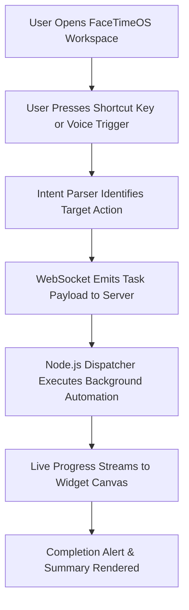

# 🔄 App Flow & User Journey - Agent Shortcut for All Work (FaceTimeOS)

## 1. User Journey Sequence

---

## 2. Interaction Phases
1. **Trigger Phase**: User presses custom key binding or speaks command.
2. **Dispatch Phase**: Central router validates permissions and launches task worker.
3. **Execution & Feedback**: Background task reports status updates over WebSockets.
4. **Completion**: Notification banner displayed and results logged to workspace history.
